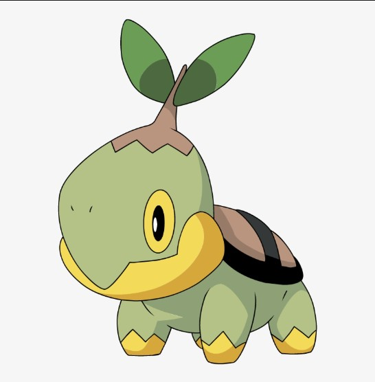

```{r}
#| label: Load Packages
#| include: false

# Load packages here
pacman::p_load(tidymodels, tidyverse, readxl, ggrepel)

```

```{r}
#| label: Loading data and general data wrangling
#| include: false
#| warning: false
#| cache: true

# Load data here
# https://bulbapedia.bulbagarden.net/wiki/Regional_Pok%C3%A9dex for regions data
pokemon <- read_excel("data/pokemon_df_filt.xlsx")

pokemon <- pokemon |>
  
  mutate(

    evo_stage = as.numeric(evo_stage),
    base_stat_total = (attack + defense + special_attack + special_defense + speed + hp)) |>
  
  # Filtering out the variables I will not be using
  select(-c("height", "weight", "species_id", "base_experience", "color_1", "color_2", "color_f", "egg_group_1", "egg_group_2", "url_icon", "url_image"))

```

### Introduction

For my INFO 526 final project, we'll be jumping into the world of Pokemon to answer:

- Which starter is the best, statistically, throughout the evolutionary stages?
- What does the type diversity look like through the various regions of Pokemon?

While answering the above, we'll get some insight on how well the Pokemon developers, GameFreak, balanced the games and pokemon across generations.

## Motivation

This is a passion project as I have been a fan of the series for as long as I remember! The questions I'm answering are ones that "little me" would want to know as I have always been curious on those topics along with game balance in general!

{fig-align="center" width="200"}

## Dataset Peek

```{r}
#| Label: Table Dataset
#| include: false

# Ref https://www.spsanderson.com/steveondata/posts/2025-02-24/ for help
poke_table <- data.frame(
  Variable = c("id","pokemon","type_1","type_2","hp","attack","defense","special_attack", "special_defense","speed","generation_id","starter*","evo_stage*", "region*", "base_stat_total*"),
  
  Class = c("integer", "character", "character", "character", "integer", "integer", "integer", "integer", "integer", "integer", "integer", "character", "integer", "character", "integer"),
  
  Description = c("The unique ID of each Pokemon.",
                  "The name of each pokemon.",
                  "The primary type.",
                  "The secondary type.",
                  "The HP (hit points).",
                  "The attack points.",
                  "The defense points.",
                  "The special attack points.",
                  "The special defense points.",
                  "The speed.",
                  "The generation ID of each Pokemon.",
                  "If the Pokemon is a starter or not.",
                  "Which evolutionary stage is the given Pokemon.",
                  "List of region(s) where the given Pokemon is found in the regional Pokedex",
                  "Sum of the hp, attack, defense, speed, special_attack, and special_defense variables")
  
)
```

```{r}
#| Label: Variable Table

# Ref https://www.rdocumentation.org/packages/kableExtra/versions/1.4.0/topics/kable_styling for kable_styling functions
poke_table |> 
  kableExtra::kable() |>
  kableExtra::kable_styling(font_size = 20,
                            full_width = FALSE)
```

\*New variable added to dataset

## Plot 1 : Which starter is best?

```{r}
#| Label: Final Project Q1 - Which starter is best?
#| cache: true

# Extracting my starters data
starters <- pokemon|>
  filter(starter == "Yes")


starters |>
  
  ggplot(aes(x = generation_id, y = base_stat_total))+
  
  geom_point(aes(color = type_1, shape = type_1))+
  
  facet_wrap(~evo_stage, scales = "free", ncol=1, labeller = labeller(
    evo_stage = c(
      "1" = "Starter",
      "2" = "Mid",
      "3" = "Final"
    )
  )) +
  
  geom_text_repel(aes(label = pokemon), 
                   size = 2.2,
                  nudge.y = 0.1,
                  segment.color = NA,
                  max.overlaps = 3)+ #If nothing is labeled then theyre all there
                
  #Ref https://sape.inf.usi.ch/quick-reference/ggplot2/shape for shapes
  scale_shape_manual(values = c("triangle", "square", "circle"))+
  
  labs(
    x = "Generation",
    y = "Base Stat Total",
    title = "Base Stat Totals for Starters",
    subtitle = "From Generation 1 to Generation 7",
    color = "Starter Type",
    shape = "Starter Type",
    caption = "Source: 'Pokemon' dataset | TidyTuesday\nOverlapping starters not labeled" #https://github.com/rfordatascience/tidytuesday/blob/main/data/2025/2025-04-01/readme.md
    
    
  )+
  
  
  # Ref https://ggplot2.tidyverse.org/reference/ggtheme.html for themes
  theme_bw()+
    
  theme(
    panel.grid.major.x = element_blank()
    
  )

```

## 

- If we want to look at final evolutions specifically, Swampert looks like our champion! Outside of generations 5 and 7, there is a clear winner with Fire taking 4 out of 5!

- GameFreak has had varying balance ideologies across the generations. Mirrored approach in Gens 1, 2 and 4. Mid stage evolutions 5 out of 7 generations being identical in base stat total. Gen 7 being balanced across evolution stages.

## Plot 2: Type diversity across regions

```{r}
#| Label: Final Project Q2
#| include: false
#| cache: true


penguins |>
  mutate(species = ifelse(species == "Adelie", "Adelie", "Other")) |>
  ggplot(aes(x = flipper_length_mm, y = body_mass_g, color = species)) +
  geom_point()

penguins |>
  ggplot(aes(x = bill_length_mm, y = species, color = species)) +
  geom_boxplot(linewidth = 0.75,
               outlier.size = 2.5) +
  theme_minimal(base_size = 15) +
  theme(legend.key.size = unit(0.8, "cm"))


```

## Plot 2 text

## Conclusion & Takeaways

- You are welcomed to use the default styling of the slides. In fact, that's what I expect majority of you will do. You will differentiate yourself with the content of your presentation.

- But some of you might want to play around with slide styling. Some solutions for this can be found at https://quarto.org/docs/presentations/revealjs.
